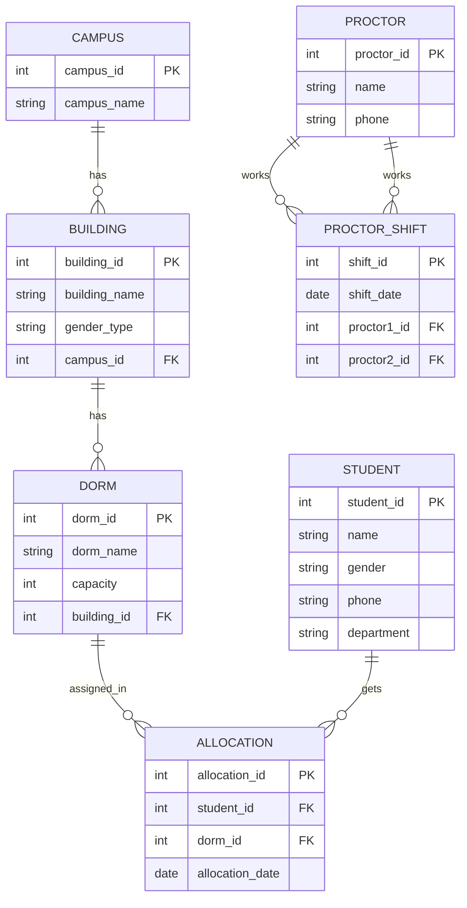

```mermaid
erDiagram
  CAMPUS ||--o{ BUILDING : has
  BUILDING ||--o{ DORM : has
  DORM ||--o{ ALLOCATION : assigned_in
  STUDENT ||--o{ ALLOCATION : gets
  PROCTOR ||--o{ PROCTOR_SHIFT : works
  PROCTOR ||--o{ PROCTOR_SHIFT : works

  CAMPUS {
    int campus_id PK
    string campus_name
  }

  BUILDING {
    int building_id PK
    string building_name
    string gender_type
    int campus_id FK
  }

  DORM {
    int dorm_id PK
    string dorm_name
    int capacity
    int building_id FK
  }

  STUDENT {
    int student_id PK
    string name
    string gender
    string phone
    string department
  }

  ALLOCATION {
    int allocation_id PK
    int student_id FK
    int dorm_id FK
    date allocation_date
  }

  PROCTOR {
    int proctor_id PK
    string name
    string phone
  }

  PROCTOR_SHIFT {
    int shift_id PK
    date shift_date
    int proctor1_id FK
    int proctor2_id FK
  }
```
